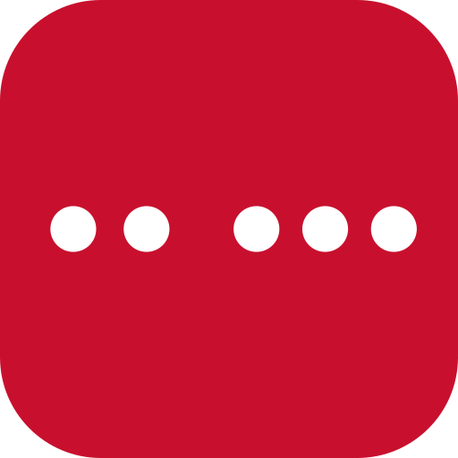

# PRD – Clave

> Stav: **návrh v0.8** · Datum: 2026-10-09 · Autor: Filip Dvořák

## 1. Shrnutí

**Clave** (doména **clave.cz**) – název podle základního rytmu salsy; španělsky zároveň „klíč“. Festivaly běží na adresách `clave.cz/<festival>` a v aplikaci se zobrazují jako „Clave · <název festivalu>“.

Webová aplikace (PWA) pro taneční festivaly, která nahrazuje papírový rozpis lekcí. Účastníci v ní procházejí program a skládají si vlastní rozvrh, organizátoři do ní zadávají program a učitelé spravují své medailonky.

Jde o **nekomerční fanouškovský projekt**. Jedna platforma hostí více festivalů a každý organizátor si v ní založí festival pod vlastní adresou (např. `clave.cz/cssf-2027`).

## 2. Cíle

- Nahradit papírový rozpis přehledným programem v mobilu.
- Umožnit účastníkům sestavit si osobní program na jednotlivé dny.
- Dát organizátorům jednoduchý nástroj na přípravu a úpravy programu.
- Provozovat zdarma nebo za minimální náklady.

### Mimo cíle (v1.0)
- Prodej vstupenek, platby, jakýkoli komerční model.
- Registrace na lekce a kapacity.
- Statistiky zájmu o lekce pro organizátory.

## 3. Měřítko

| Parametr | Hodnota |
|---|---|
| Účastníků denně | 1 000 – 20 000 |
| Lekcí denně | 15 – 60 |
| Délka festivalu | 3 – 10 dní |
| Místností | jednotky až desítky |

## 4. Role a oprávnění

| Role | Rozsah | Kdo ji přiděluje | Co může |
|---|---|---|---|
| **Návštěvník** (nepřihlášený) | – | – | Prohlížet a filtrovat program, číst medailonky učitelů |
| **Uživatel** | celá platforma | registruje se sám | Vše jako návštěvník + osobní program |
| **Učitel** | festival | organizátor (pozvánkou e-mailem nebo povýšením účtu) | Vše jako uživatel + úprava vlastního medailonku |
| **Organizátor** | festival | hlavní organizátor festivalu | Správa programu, místností, stylů, učitelů festivalu |
| **Hlavní organizátor** | festival | správce platformy nebo jiný hlavní organizátor | Vše jako organizátor + přidávání/odebírání organizátorů a hlavních organizátorů |
| **Správce platformy** | celá platforma | jiný správce platformy | Zakládání festivalů, určení hlavního organizátora, přidávání správců platformy |

Pravidla:
- Organizátor má práva **jen ke svému festivalu**.
- Učitel je k festivalu přiřazen organizátorem. Účet i medailonek jsou **globální** (jeden napříč festivaly).
- Organizátor může učitele pozvat e-mailem nebo povýšit existující účet na učitele.
- Učitel může být u lekcí uvedený **ještě před přijetím pozvánky** (i bez účtu); medailonek mu zatím vyplní organizátor. Po přijetí pozvánky se profil propojí s jeho účtem.
- **Vyhledávání účtů:** běžné uživatele lze najít jen podle **přesného e-mailu** (ochrana soukromí); učitele (veřejné profily) i podle jména.
- **Smazání účtu učitele:** u lekcí (i minulých festivalů) zůstane jen jméno, medailonek a fotka se smažou.
- Správců platformy může být víc; prvním je provozovatel, další přidává stávající správce platformy.
- **Medailonek učitele:**
  - Globální medailonek spravuje učitel s vlastním účtem sám; dokud účet nemá, upravují ho organizátoři festivalů, kde učí.
  - Organizátor může pro **svůj festival** napsat vlastní verzi (popis CZ/EN, fotka). Ta má na jeho festivalu přednost, prázdná pole převezmou globální medailonek.
  - Důvod: medailonek je společný pro všechny festivaly – cizí organizátor ho nesmí přepsat.
- Festival může mít **více hlavních organizátorů**; hlavní organizátor může roli předat nebo udělit dalšímu.
- Organizátoři mají v v1.0 stejná práva (jen dvě úrovně: hlavní organizátor / organizátor). Jemnější úrovně oprávnění: v1.1.

### 4.1 Přístup organizátorů
- Organizátoři se přihlašují stejně jako ostatní uživatelé (Google / magic link), bez dalšího ověření. Zabezpečení se přehodnotí ve v1.1 podle zkušeností (případně jen Google účet).
- **Pozvánka e-mailem:**
  - Správce platformy pozve hlavního organizátora zadáním e-mailu při založení festivalu.
  - Hlavní organizátor stejným způsobem zve další organizátory.
  - Pozvanému přijde e-mail s odkazem; po přihlášení s daným e-mailem dostane roli automaticky. Funguje i pro lidi, kteří ještě nemají účet.
  - Pozvánku lze zrušit, dokud není přijata.
- **Povýšení stávajícího účtu:** hlavní organizátor může povýšit existující uživatelský účet na organizátora (bez pozvánky).
- Žádost o založení festivalu formulářem v aplikaci (schvaluje správce platformy): v1.1.

## 5. Funkce

### 5.1 Program (všichni, i bez přihlášení)

**Mřížka programu**
- Přepínání mezi dny festivalu.
- Řádky = časové sloty, sloupce = místnosti.
- Lekce je obarvená podle **stylu**.
- Karta lekce: název / co se učí, učitel(é), level, čas, místnost.
- Lekce může zabírat **více po sobě jdoucích slotů** (workshop); v mřížce se roztáhne přes více řádků.
- Večerní **párty** se zobrazují v programu jako samostatný typ akce (bez levelu, učitel volitelný). Párty přes půlnoc patří ke dni, kdy začala (konec se zobrazí jako např. „04:00 (+1)“).
- Všechny časy se zobrazují v **časovém pásmu festivalu**, bez ohledu na nastavení telefonu.

**Teď probíhá**
- Během festivalu se aplikace otevře na dnešním dni, posune se na aktuální čas a probíhající lekce zvýrazní (zvýrazňující barvou festivalu).

**Level**
- Škála 0–3 kolečka v krocích po 0,5 (tj. 7 hodnot: 0; 0,5; 1; … 3).
- Zobrazení: 3 kolečka, prázdná / poloplná / plná. 0 = nejlehčí, 3 = nejpokročilejší.
- Lekce „pro všechny úrovně“ má level 0 (3 prázdná kolečka) – nejlehčí úroveň a „pro všechny“ se nerozlišují.

**Filtry**
- Styl, místnost, učitel, level, den.
- Filtry lze kombinovat.

**Detail lekce**
- Všechny údaje lekce + odkazy na medailonky učitelů.

**Zrušená lekce**
- Zůstává v programu **přeškrtnutá se štítkem „Zrušeno“** (nemizí).

**Sdílení**
- Každá lekce i medailonek učitele má vlastní sdílitelný odkaz (např. do WhatsAppu); otevře přímo detail.

**Medailonek učitele**
- Jméno, fotka, krátký popis.
- Seznam lekcí učitele na daném festivalu.

**Hlavní stránka platformy**
- Seznam aktuálních a nadcházejících zveřejněných festivalů.
- Přihlášený uživatel vidí nahoře festivaly, kde má osobní program.
- Archiv minulých festivalů.

**Praktické informace** (menu „Více“)
- Stránky festivalu s textem a obrázky (CZ/EN) – např. mapa areálu, adresy sálů, kontakty, pravidla.
- Dostupné i offline.

**Mobilní zobrazení**
- Mřížka s horizontálním scrollem přes místnosti a ukotveným sloupcem s časy.
- Přepínač na **seznamové zobrazení** (lekce pod sebou seřazené podle času).

### 5.2 Osobní program (přihlášený uživatel)

- Označení lekce / párty jako „chci jít“.
- Pohled „Můj program“ po dnech.
- **Kolize:** při výběru lekce, která se časově překrývá s jinou vybranou, aplikace upozorní, ale výběr umožní.
- Výběr je **soukromý** (organizátor ho nevidí).
- Výběr vyžaduje připojení (offline jen čtení – viz 6.2).

### 5.3 Informování o změnách

- Když organizátor změní lekci z osobního programu uživatele (čas, místnost, učitel, zrušení), lekce dostane štítek **„Změna“**.
- Po otevření aplikace se zobrazí **seznam změn od poslední návštěvy**.
- Push notifikace: v1.1.

### 5.4 Správa festivalu (organizátor)

**Festival**
- Název, URL slug, termín (dny), **časové pásmo**, popis.
- Vizuální identita (logo, banner, barvy, písmo) – nastavuje hlavní organizátor, viz kap. 7.
- Stav **koncept / zveřejněno / archiv**:
  - Koncept: program vidí jen organizátoři festivalu.
  - Zveřejněno: program je veřejný, změny se projeví okamžitě.
  - Archiv: po skončení festivalu; program zůstává veřejně ke čtení; osobní program zůstává ke čtení jen svému majiteli.

**Časový rámec**
- Pro každý den vlastní sada časových slotů (začátek–konec).
- Sloty se mezi dny mohou lišit (např. den 1: 11:30–12:30, 12:40–13:40…; den 2: od 10:00 po 45 min, 8× za sebou).
- Pomůcka pro rychlé generování slotů (začátek, délka, pauza, počet) a kopírování rozvrhu slotů z jiného dne.

**Místnosti**
- Přidání, úprava, odebrání, pořadí (pořadí = pořadí sloupců v mřížce).
- Místnost ani časový slot, ve kterém jsou lekce, **nelze smazat**, dokud se lekce nepřesunou nebo nesmažou.

**Styly**
- Seznam stylů spravuje organizátor, každému přiřadí libovolnou barvu (RGB).

**Lekce**
- Den, počáteční a koncový slot (lekce může trvat více slotů), místnost, styl, název / co se učí, level, 1+ učitelů, volitelně popis.
- V jednom slotu a místnosti smí být **jen jedna lekce** (hlídá formulář i import).
- Úpravy i za běhu festivalu (spouští informování o změnách).
- Lekci lze **zrušit** (zůstane v programu přeškrtnutá, viz 5.1) nebo smazat.
- **Varování:** když učitel učí ve stejném čase ve dvou místnostech (uložení lze potvrdit).

**Párty**
- Den, čas (volný, mimo sloty, může přesahovat přes půlnoc), místo (místnost festivalu **nebo** vlastní text, např. „Beach bar“), název, popis.

**Učitelé**
- Vyhledání existujícího učitele na platformě (podle jména) a přidání do festivalu.
- Pozvání nového učitele e-mailem, nebo povýšení existujícího účtu (hledání podle přesného e-mailu).
- Přidání učitele bez účtu (jen jméno + medailonek), pozvánku lze poslat i později.
- Vlastní verze medailonku pro tento festival (vždy).
- Úprava globálního medailonku jen u učitele bez účtu; učitel vidí historii změn a může změnu vrátit.

**Organizátoři** (hlavní organizátor)
- Pozvání e-mailem / povýšení stávajícího účtu (viz 4.1).
- Odebrání organizátorů, udělení / předání role hlavního organizátora.

**Praktické informace**
- Vytváření, úprava, řazení a mazání informačních stránek (text, obrázky, CZ/EN).

**QR kód festivalu**
- V nastavení festivalu ke stažení QR kód odkazující na `clave.cz/<festival>` s logem Clave uprostřed (pravidla viz 7.6).
- Formáty PNG (vysoké rozlišení) a SVG pro tisk (plakáty, stojánky, materiály).

**Log změn**
- Záznam všech změn festivalu: kdo, kdy, co (např. „Petr přesunul Salsa On2 do Sálu B“).
- Zahrnuje program, místnosti, styly, učitele, organizátory, vizuální identitu i importy.
- Vidí ho organizátoři festivalu.

### 5.4.1 Import programu

**Import z Excelu / CSV**
- Organizátor si stáhne šablonu (XLSX a CSV). Jeden řádek = jedna lekce / párty: ID, typ, den, začátek, konec, místnost, styl, název (CZ/EN), level, učitelé (oddělení čárkou), popis (CZ/EN).
- Po nahrání aplikace automaticky založí chybějící místnosti, styly, časové sloty a učitele. Učitele nejprve hledá mezi existujícími na platformě a nabídne shodu.
- **Náhled před uložením:** tabulka s tím, co se vytvoří / změní, a zvýrazněné chyby (neplatný level, chybějící údaje, dvě lekce ve stejném slotu a místnosti, neznámý učitel…).
- **Export:** aktuální program festivalu lze stáhnout ve formátu šablony, každá lekce má vyplněné `ID`.
- **Opakovaný import (párování podle ID):** organizátor exportuje program, upraví ho a nahraje zpět.
  - Řádek s ID = úprava existující lekce (zůstává uživatelům v osobním programu).
  - Řádek bez ID = nová lekce.
  - Lekce, jejíž ID v souboru chybí, se v náhledu nabídne ke smazání a organizátor ji potvrdí.
  - Štítek „Změna“ (5.3) dostanou jen lekce, které se skutečně změnily.

**Prompt pro AI**
- U importu je připravený text promptu ke zkopírování. Organizátor ho vloží do své AI (ChatGPT, Claude, Gemini…) spolu se svým PDF / obrázkem / tabulkou programu a AI mu vrátí CSV ve formátu šablony.
- Prompt obsahuje přesný popis sloupců a pravidla (formát času, škála levelu) a automaticky i aktuální seznam místností, stylů a učitelů festivalu, aby AI použila stejné názvy.
- Výsledek pak organizátor nahraje běžným importem (včetně náhledu a kontroly chyb).
- Aplikace sama žádné AI API nevolá → bez nákladů.

**Kopie z minulého ročníku**
- Organizátor smí kopírovat jen festivaly, kde je organizátorem. Nový festival zakládá správce platformy, organizátor do něj pak zkopíruje data.
- Kopírují se: místnosti, styly, časové sloty, učitelé, volitelně i lekce.
- Data se posunou na nový termín, organizátor pak jen upraví rozdíly.

### 5.5 Učitel

- Úprava vlastního globálního medailonku (jméno, fotka, popis) na stránce „Můj profil učitele“, historie změn s možností vrátit.
- Přehled svých lekcí na festivalech.

### 5.6 Správce platformy

- Založení festivalu a pozvání hlavního organizátora (viz 4.1).
- Přidávání a odebírání dalších správců platformy.

## 6. Nefunkční požadavky

### 6.1 Platforma
- Webová aplikace, **PWA** (instalovatelná na plochu), mobile-first, Android i iOS.

### 6.2 Offline (v1.0)
- Při otevření se program festivalu stáhne do zařízení.
- Bez signálu lze prohlížet program, filtrovat, vidět svůj rozvrh a praktické informace.
- Po obnovení připojení se načtou změny.
- Úpravy osobního programu offline: v1.1.

### 6.3 Jazyky
- Rozhraní česky a anglicky.
- Obsah zadávaný organizátorem (názvy lekcí, popisy): jeden jazyk povinně, druhý volitelně. Když překlad chybí, zobrazí se originál.

### 6.4 Výkon
- Program je převážně ke čtení → cachování na CDN, aby aplikace zvládla 20 000 uživatelů denně v rámci free tierů.
- Fotky učitelů se při nahrání zmenšují.

### 6.5 Soukromí
- GDPR: uživatel může smazat svůj účet a data.
- Ukládáme minimum osobních údajů (jméno, e-mail, výběr lekcí).
- **Provozovatel a správce osobních údajů:** Filip Dvořák (fyzická osoba).
- Před spuštěním: zásady ochrany osobních údajů a podmínky užívání.

### 6.6 Provoz a zálohy
- **Denní záloha databáze** každé ráno v **6:00** (čas Praha) pomocí **GitHub Actions**.
- Zálohy se ukládají do samostatného **soukromého repozitáře `clave-backups`** – obsahují osobní údaje, nesmí být ve veřejném repozitáři.
- Uchovává se **posledních 30 záloh**, starší se automaticky mažou.
- Denní připojení zálohy k databázi zároveň brání **uspání Supabase** (free tier se uspí po týdnu bez aktivity) – archiv minulých festivalů tak zůstává dostupný i mezi festivaly.
- Úloha musí řešit, že GitHub vypíná naplánované workflow po 60 dnech bez aktivity v repozitáři (např. automatickým commitem zálohy).
- Čas spuštění v GitHub Actions je v UTC (přepočet letní / zimní čas), spuštění se může zpozdit o několik minut.

## 7. Grafický design

### 7.1 Princip
- Aplikace má **jeden neutrální základní design**, který je na všech festivalech stejný (rozložení, ovládání, mřížka).
- Festival ho „obléká“ do své vizuální identity: logo, banner, barvy, písmo.
- Mobile-first, plochý čistý vzhled, podpora **světlého i tmavého režimu** (podle nastavení telefonu).

### 7.2 Vizuální identita festivalu (hlavní organizátor)

**Logo**
- Dvě verze: **široké** (hlavička, úvodní stránka festivalu) a **čtvercové** (ikona PWA na ploše, favicon, splash screen).

**Banner**
- Úvodní obrázek / fotka na hlavní stránce festivalu.

**Barevné schéma: 1–5 barev zadaných RGB (hex) kódem, každá má pevnou roli:**

| # | Role | Kde se projeví | Povinná |
|---|---|---|---|
| 1 | Hlavní | Hlavička, vybraný den, tlačítka, aktivní položka menu | ano |
| 2 | Doplňková | Akcenty, odkazy, podbarvení párty | ne |
| 3 | Zvýrazňující | Štítek „Změna“, „chci jít“, „teď probíhá“ | ne |
| 4 | Podklad | Barva pozadí stránky | ne |
| 5 | Text | Barva písma | ne |

- Chybějící barvy aplikace **dopočítá** z hlavní barvy (odstíny).
- Pro tmavý režim se barvy festivalu automaticky upraví (zesvětlení akcentů, tmavý podklad).

**Písmo**
- Výběr z **5 předpřipravených písem** (s podporou české diakritiky).

### 7.3 Pojistky čitelnosti
- Barva textu na barevných plochách (bílá / tmavá) se volí **automaticky podle kontrastu**.
- Nečitelná kombinace (pod WCAG AA) → varování organizátorovi a návrh upravené barvy.
- Varování, když je barva festivalu téměř shodná s barvou některého stylu.
- **Živý náhled** aplikace při nastavování identity.

### 7.4 Mřížka programu
- Podklad mřížky zůstává **neutrální** (bílý / tmavý); barvy festivalu do ní nezasahují.
- Lekce: jemně podbarvená barvou stylu, barevná tečka + název stylu, název lekce, učitel(é), kolečka levelu, srdíčko „chci jít“.
- Barvy stylů volí organizátor volně; pro tmavý režim se automaticky upraví.
- Prázdný slot = přerušovaný rámeček.
- Párty pod mřížkou jako samostatný řádek podbarvený doplňkovou barvou.

### 7.5 Navigace
- Hlavička: logo, název a termín festivalu, filtry.
- Pod hlavičkou záložky dnů.
- Spodní menu: Program, Můj program, Učitelé, Více.

### 7.6 Logo platformy Clave

- **Motiv:** pět teček v rytmu **2-3 clave**, rozdělených do dvou jasně oddělených skupin (2 + 3) s pravidelnými rozestupy, aby se tečky ani v malé velikosti neslévaly.
- **Tvar:** čtverec se zaoblenými rohy (radius 22 % strany), tečky ve vodorovné řadě uprostřed.
- **Barvy:** podklad **salsa červená `#C8102E`**, tečky bílé `#FFFFFF`.
- **Nápis:** „clave“ malými písmeny, vedle ikony, v barvě `#C8102E` (na tmavém pozadí bílý).
- **Zdrojový soubor:** [`docs/brand/clave-logo.svg`](brand/clave-logo.svg).
- **Použití:**
  - ikona PWA a favicon samotné platformy, hlavní stránka platformy,
  - střed QR kódů (viz níže),
  - uvnitř festivalu jen decentně („Clave · <festival>“), případně jednobarevně šedé, aby nesoupeřilo s identitou festivalu.

**Logo v QR kódu**
- QR kódy se generují s nejvyšší úrovní oprav chyb (**H**).
- Logo je uprostřed na bílém poli se zaoblenými rohy, pole zabírá max. ~30 % šířky kódu (~9 % plochy).
- Kolem loga bílý okraj; logo musí zůstat čitelné i při velikosti kódu ~2 cm.
- Každý vygenerovaný QR kód se před použitím ověří naskenováním.

## 8. Přihlašování

- **Google** – hlavní způsob.
- **Magic link** (odkaz do e-mailu) – záložní, pod „Jiný způsob přihlášení“.
- Apple Sign-In: zatím ne (99 $/rok).

## 9. Technologie

| Vrstva | Volba |
|---|---|
| Frontend | Next.js (React), PWA |
| Backend / DB | Supabase (Postgres, Auth, Storage, Realtime) |
| Hosting | Vercel (Hobby) |
| E-maily | Resend (nebo jiná SMTP služba) pro magic link |
| Automatizace | GitHub Actions (denní záloha) |
| Verzování | Git, GitHub (`clave` veřejný, `clave-backups` soukromý) |

**Náklady:** vývoj a menší festival 0 Kč. Velký festival možná 25–45 $ za měsíc konání (Supabase Pro, placené e-maily). Volitelně doména ~200–300 Kč/rok.

## 10. Datový model (náčrt)

- **User** – id, jméno, e-mail, jazyk
- **TeacherProfile** – user_id (volitelné, profil může existovat bez účtu), jméno, fotka, bio CZ/EN (globální)
- **TeacherProfileRevision** – profile_id, autor, čas, předchozí obsah
- **Festival** – id, slug, název, termín, časové pásmo, stav, logo (široké, čtvercové), banner, barvy (1–5), písmo
- **FestivalMember** – festival_id, user_id, role (hlavní organizátor / organizátor / učitel)
- **Day** – festival_id, datum
- **TimeSlot** – day_id, začátek, konec
- **Room** – festival_id, název, pořadí
- **Style** – festival_id, název, barva
- **Lesson** – festival_id, start_slot_id, end_slot_id, room_id, style_id, název CZ/EN, level, popis CZ/EN, zrušeno (ano/ne), updated_at (sloty a místnost se nesmí překrývat s jinou lekcí)
- **FestivalTeacher** – festival_id, teacher_profile_id, vlastní popis CZ/EN a fotka pro festival
- **LessonTeacher** – lesson_id, teacher_profile_id
- **InfoPage** – festival_id, pořadí, nadpis CZ/EN, obsah CZ/EN
- **PlatformAdmin** – user_id
- **Party** – festival_id, den, začátek, konec, room_id nebo vlastní místo, název, popis
- **PersonalSelection** – user_id, lesson_id / party_id
- **Invitation** – festival_id, e-mail, role, pozval, stav, expirace
- **ChangeLog** – festival_id, autor, čas, entita, akce, změněná data

## 11. Roadmapa

### v1.0
Vše výše uvedené.

### v1.1
- Kapacity lekcí / registrace.
- Statistiky zájmu pro organizátory a anonymní statistika návštěvnosti (bez cookies).
- Export osobního programu (iCal, PDF).
- Push notifikace o změnách.
- Úpravy osobního programu offline.
- Import vložením mřížky z tabulky (copy-paste), případně AI import přímo v aplikaci.
- Žádost o založení festivalu formulářem.
- Různé úrovně oprávnění organizátorů.
- Přehodnocení zabezpečení přihlášení organizátorů.

### Později
- Přístupnost (kontrasty, čtečky obrazovky, zvětšitelné písmo) nad rámec automatické kontroly kontrastu.

## 12. Otevřené otázky

Zatím žádné.
